# FIS 2.0 Financial Agile Integration Demo

This Financial demo is a simple gateway that redirect the incoming request of
 - Checking balance
 - Transfer money
to different money source, one pass to a traditional banking microservice app, which interact directly with MySQL database, and pass the bitcoin request to the other microservice application connecting to a mock-blockchain through messaging broker.


There are many aspect with this demo,
1. Source to Image (S2i) build and deploy process
2. Building a pipeline to support automated CI/CD
3. Exposing RESTAPI using Camel, and export API doc to swagger
4. Manage API through 3scale API management
5. Running Hystrix among APIs


but first, let's start with setting up the application.

## Setting up DEV and UAT Environemnt
***Install OpenShift Container Platform 3.5 in [CDK 3.0](https://developers.redhat.com/products/cdk/overview/)***

Download the git repository by either forking it, or simply cloning it.
(My suggesting is to fork it, if you want to play with the code)

```
git https://github.com/YOUR_RPEO/fuse-financial-cicd.git
```

Start up your OpenShift environment by running

```
minishift start --username <USERNAME> --password <PASSWORD>
```


And log back in as developer, install the messaging template that we will use later in the process.


```
oc login -u developer

# Create DEV/UAT deployment pace
oc new-project fisdemo --display-name="Fuse Banking Demo - Dev and UAT" --description="Development and UAT environment for Agile Integration Banking Demo - Power by Red Hat Fuse"

# Import AMQ image for later
oc import-image amq62-openshift --from=registry.access.redhat.com/jboss-amq-6/amq62-openshift --confirm

cd support
# Create template for AMQ
oc create -f projecttemplates/amq62-openshift.json

```

## Setup MySql database, AMQ broker and Jenkins 

You can either setup all of them using GUI on OpenShift console, or using command line as follows


```
oc create -f https://raw.githubusercontent.com/openshift/origin/master/examples/db-templates/mysql-ephemeral-template.json

oc new-app --template=mysql-ephemeral --param=MYSQL_PASSWORD=password --param=MYSQL_USER=dbuser --param=MYSQL_DATABASE=sampledb

oc new-app --template=amq62-basic --param=MQ_USERNAME=admin --param=MQ_PASSWORD=admin --param=IMAGE_STREAM_NAMESPACE=fisdemo

```

## Pushing application to OpenShift
For the two microservice
 - Traditional Bankling
 - Bitcoin Gateway
We will using the Binary S2i to upload the application.
Go to your traditional banking account project folder, and run


```
cd ..
cd fisdemoaccount
mvn fabric8:deploy -Dmysql-service-username=dbuser -Dmysql-service-password=password
```


Do the same to the bitcoin gateway under it's project folder


```
cd ..
cd fisdemoblockchain
mvn fabric8:deploy
```

After successfully install the application, it's time to deploy the API Gateway. This time, we are going to build a pipeline, that goes through and automated the CI/CD process from staging to UAT.

```
cd ..
oc process -f support/projecttemplates/template-uat.yml | oc create -f -
oc start-build fisgateway-service
```

Congradulations! You can now start playing with the demo!
And here are some of the ways you can play with it!
In your browser test the following links

```
http://fisgateway-service-fisdemo.<OPENSHIFT_HOST>/demos/sourcegateway/balance/234567?moneysource=bitcoin
http://fisgateway-service-fisdemo.<OPENSHIFT_HOST>/demos/sourcegateway/balance/234567
```

[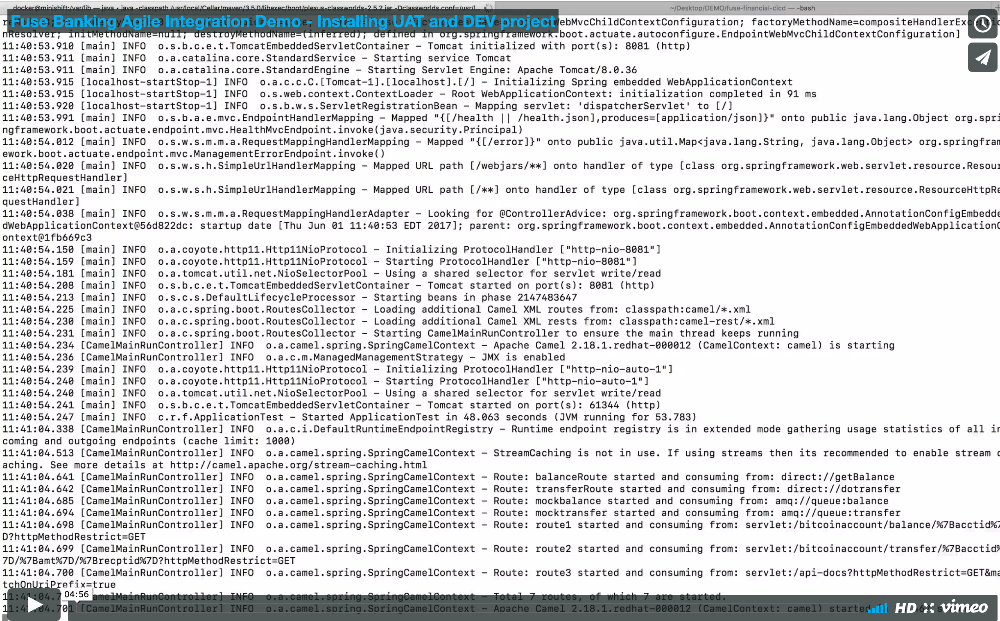](https://vimeo.com/219952887 "Fuse Banking Agile Integration Demo - Installing UAT and DEV project")


## Starting up Banking GUI

If you want something fancy, try installing the GUI for the application.

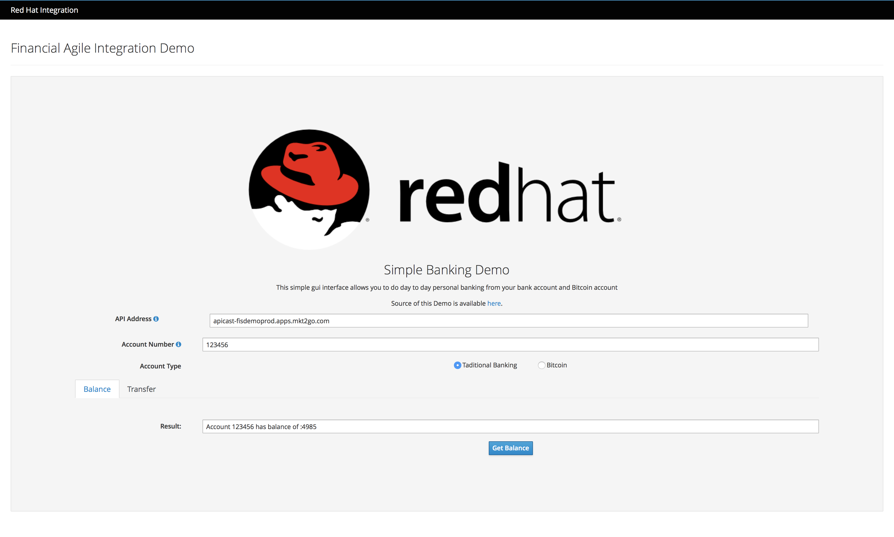

```
cd fisdemogui
oc new-project fisdemogui --display-name="Fuse Banking Demo - GUI" --description="Web GUI for Banking demo, does transfer and balance enquiry"
oc new-build --image-stream=nodejs --binary=true --name=fisdemogui
oc start-build fisdemogui --from-dir=.

#Wait until Build finished
oc new-app fisdemogui
oc expose svc fisdemogui
```

In your browser http://fisdemogui-fisdemogui.<OPENSHIFT_HOST>/
Once the application is running, set the your API IP Address to *fisgateway-service-fisdemo.<OPENSHIFT_HOST>* and play around with it.

[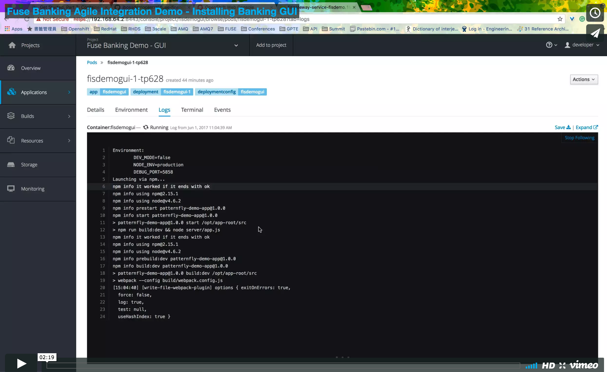](https://vimeo.com/219955921 "Fuse Banking Agile Integration Demo - Installing Banking GUI")

## Setting Up Production Environment
Create a Production project for FISDEMO
Add setup the environment including supporting microservices and configurations (deployment configs/service/route) in production

```
cd support
./setupProd.sh
```


## API resiliency with Hystrix

Spin up the Hystrix dashboard and Turbine server using the provided kubeflix.json template

```
oc process -f kubeflix.yml | oc create -f -
```

[](https://vimeo.com/219957939 "Fuse Banking Agile Integration Demo - Installing PROD project")


## Setting up 3scale API Management
There are two ways for you to setup 3scale

1. **Option ONE:** (RECOMMANDED) Sign up for a 45 day trial version online, go to
```
https://www.3scale.net/signup/
```
You will receive a administration domain to manage APIs.

   **Option TWO:** Spin up local 3scale environment

   **WARNING!!! You need at LEAST 16 GB of memories assgined to CDK**

   A.  Create a project

	```
	oc new-project threescaleonprem
	```
   B.  Setup persistence volume (if you are running with CDK V3/Minishift V1, this is optional)
	```
	oc new-app -f support/amptemplates/pv.yml 	```
   C.  Install 3scale into the project by excuting following command. The WILDCARD_DOMAIN parameter set to the domain of the OpenShift for your CDK:

	```
	oc new-app -f support/amptemplates/amp.yml --param WILDCARD_DOMAIN=<WILDCARD_DOMAIN>
	```

   For detail installation, please visit the official installation page.

2. Retreive Access token

	**Option ONE:**

	A. In admin console, top right hand corner, select *Personal Setting*, click on Tokens on the top tab, and click on **Add Access Token**.

	B. Crate the token by settin the following information

	- **Name**: demomgmttoken
	- **Scopes**: Account Management API
	- **Permission**: Read & Write

	Rember the generated access token and don't lose it!


	**Option TWO:**

	After successfully installing 3scale backend system on OpenShift, should be provided as part of the result output on the execution console.


3. Configure 3scale setting, run following script along with your credentials to setup 3scale

	```
	cd threescalesetup
	mvn clean package
	mvn exec:java -Dexec.mainClass=threescalesetup.SetupApp -Dexec.args="<3SCALE_HOST_DOMAIN> <ACCESS_TOKEN> financeapidemo financeapidemo true productiondemo 'Finance API Demo for Agile Integration'"
	cd ..
	```
	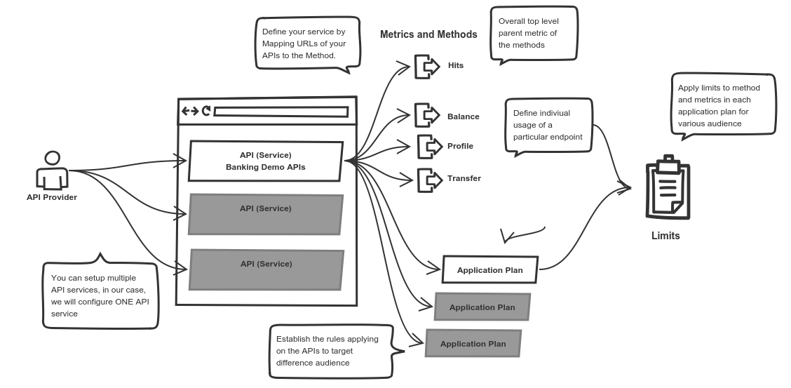

4. Setup accounts to access the API service.

	```
	cd threescalesetup
	mvn exec:java -Dexec.mainClass=threescalesetup.SetupAccount -Dexec.args=<3SCALE_HOST_DOMAIN> <ACCESS_TOKEN> <APPLICATION_PLAN_ID> financedemoapp 'The Finance Demo Application'
	cd ..
	```


5. Install APICast to UAT and PROD projects, with your access token and 3scale admin domain name

	```
	oc project fisdemoprod
	oc secret new-basicauth apicast-configuration-url-secret --password=https://<ACCESS_TOKEN>@<DOMAIN>-admin.3scale.net

	oc new-app -f support/amptemplates/apicast.yml
	```

	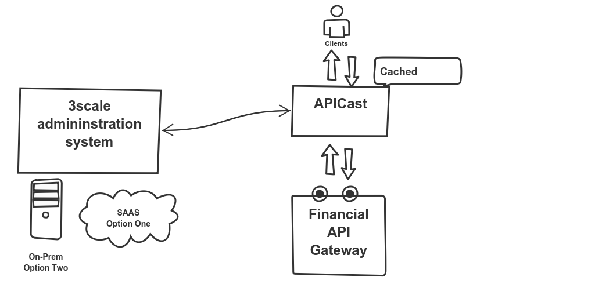

6. Update 3scale Integration configuration address

	Now, these setups can only be set manually, go to your 3scale admin page, login, Select **API** tab on top, and click onto *Fuse Financial Agile Integration Demo Service*. On the left tabs, choose **Integration**, and delete **edit Apicast Configuration**

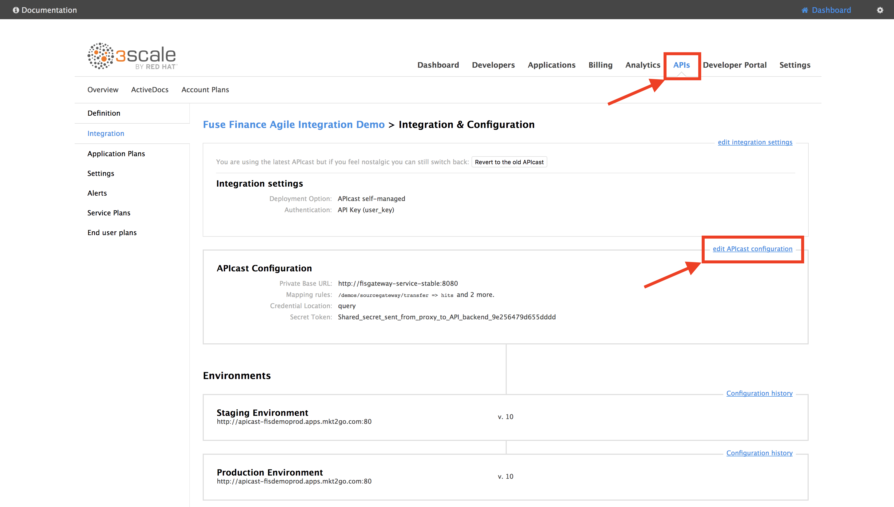

Here is where we tell Apicast where to look for our APIs and how the APIs can be accessed.

- Set Private Base URL to : **http://fisgateway-service-stable:8080**
- Set both your Public Basic URL to : **http://apicast-fisdemoprod.<OPENSHIFT_HOST>**
- Set the three API endpoints accrodingly:
	- GET /demos/sourcegateway/balance
	- GET /demos/sourcegateway/profile
	- POST /demos/sourcegateway/transfer

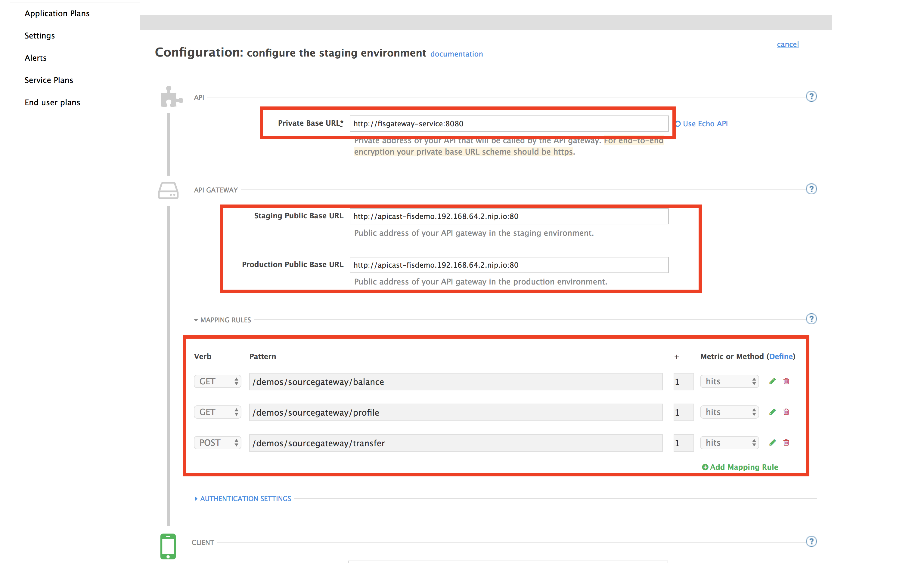

[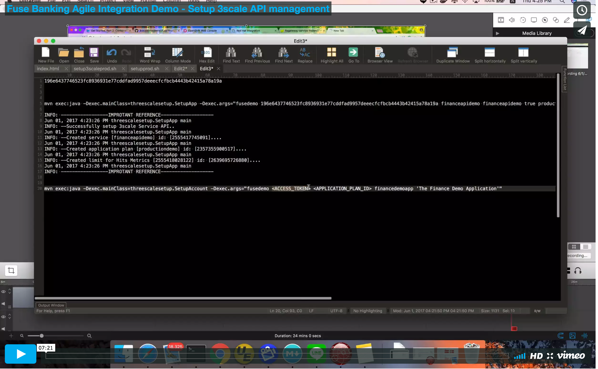](https://vimeo.com/220360925 "Fuse Banking Agile Integration Demo - Setup 3scale API management")

## CI/CD across integration solution

### IMPORTANT!!! Please make sure you have 3scale account setup Following CI/CD A-B Testing pipeline to work.

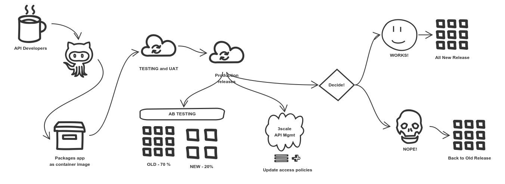


Create a project to all pipelines

```
oc new-project fisdemocicd --display-name="Fuse Banking Pipeline" --description="All CI/CD Pipeline for Banking Demo"
```

Grant access to cicd project user so it can operate on UAT and PROD env

```
oc policy add-role-to-group edit system:serviceaccounts:fisdemocicd -n fisdemo
oc policy add-role-to-group edit system:serviceaccounts:fisdemocicd -n fisdemoprod
```

Install all three pipelines

```
oc create -f support/pipelinetemplates/pipeline-uat.yml
oc create -f support/pipelinetemplates/pipeline-ab.yml
oc create -f support/pipelinetemplates/pipeline-allprod.yml

oc new-app pipeline-uat

oc new-app pipeline-ab \
--param=THREESCALE_URL=https://<3SCALE_HOST_DOMAIN>-admin.3scale.net \
--param=API_TOKEN=<ACCESS_TOKEN> \
--param=APP_PLAN_ID=<APPLICATION_PLAN_ID> \
--param=METRICS_ID=<METRICS_ID> \
--param=API_LIMITS=25 \
--param=OPENSHIFT_HOST=<OPENSHIFT_HOST>

oc new-app pipeline-allprod \
--param=THREESCALE_URL=https://<3SCALE_HOST_DOMAIN>-admin.3scale.net \
--param=API_TOKEN=<ACCESS_TOKEN> \
--param=APP_PLAN_ID=<APPLICATION_PLAN_ID> \
--param=METRICS_ID=<METRICS_ID> \
--param=API_LIMITS=50 \
--param=OPENSHIFT_HOST=<OPENSHIFT_HOST>
```

The Banking pipeline project includes 3 pipelines demonstrate the possible flow of an integration application of Fuse.

A. The pre-built UAT pipeline builds the image from SCM (github). and deploy a testing instance onto the platform. Then a pre-UAT test is done by a QA (you), after verification, you can choose to reject the change or promote it to UAT, by tagging the image with uatready flag. When promoted, the pipeline will deploy the uat tagged image on openshift, with UAT route linked to it.

B. A/B Testing pipeline will move UAT image from the UAT project to Production project by tagging and deploying the image, and allocate 30% of traffic to the new service and 70% to existing stable service. Also updates all traffics from API management layer to 25 calls per minutes.

C. Ready for full release. The all production pipeline will do the rolling update, old service will be replace by the new service as now become the stable version. All traffic will then redirect to the stable new version of running instance.

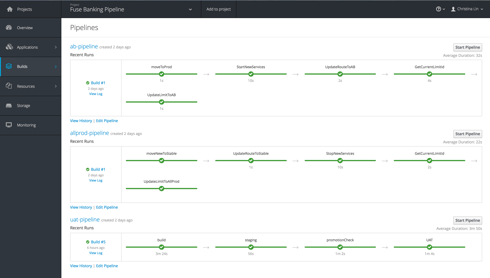

[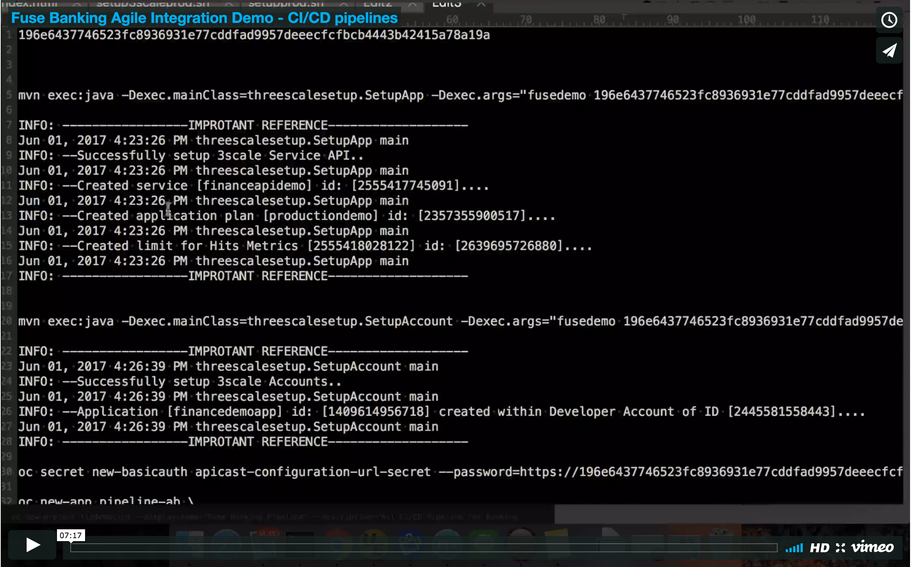](https://vimeo.com/220360925 "Fuse Banking Agile Integration Demo - Setup CI/CD pipelines")


## Version update notes, and TODOs
- V2 . REMOVE UAT pipeline from UAT project into the pipeline Project
- V2 . Added Hystrix
- V2 . Added 3scale API management
- V2 . Added CICD for Production
- V2 . Added Banking GUI
- TODO: Configmaps and secrets
