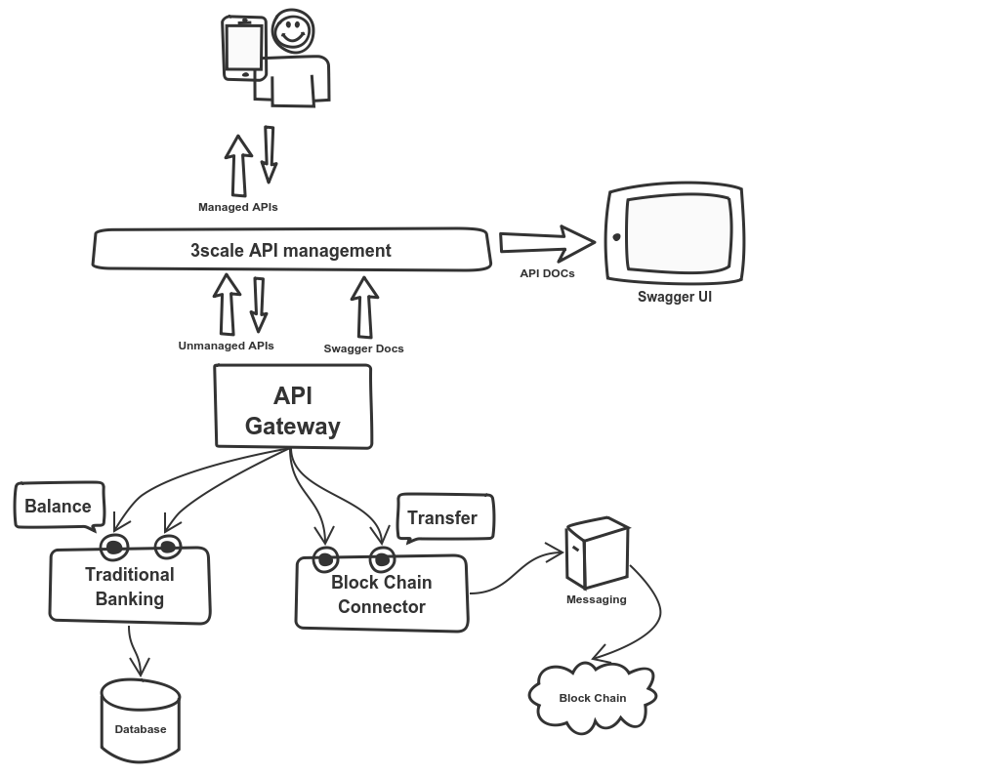

# FIS 2.0 Financial Demo

This Financial demo is a simple gateway that redirect the incoming request of 
 - Checking balance
 - Transfer money 
to different money source, one pass to a traditional banking microservice app, which interact directly with MySQL database, and pass the bitcoin request to the other microservice application connecting to a mock-blockchain through messaging broker. 



There are many aspect with this demo, 
1. Source to Image (S2i) build and deploy process
2. Building a pipeline to support automated CI/CD
3. Exposing RESTAPI using Camel, and export API doc to swagger

but first, let's start with setting up the application. 

## Setting up OpenShift 
[Install OpenShift Container Platform 3.3] (https://github.com/redhatdemocentral/ocp-install-demo) 
Start up your local OpenShift environment by running 
	
```
oc cluster up
```

Then login as system admin to install the FIS 2.0 Tech preview image stream. (NO need when G.A.)
	
```
oc login -u system:admin
oc project openshift
oc create -f https://raw.githubusercontent.com/jboss-fuse/application-templates/master/fis-image-streams.json
```

And log back in as developer, install the messaging template that we will use later in the process. 

	
```
oc login -u developer
oc new-project fisdemo --display-name="Fuse Banking Demo - Dev and UAT" --description="Development and UAT environment for Agile Integration Banking Demo - Power by Red Hat Fuse"
oc create -f https://raw.githubusercontent.com/jboss-openshift/application-templates/master/amq/amq62-basic.json
```

## Setup MySql database, A-MQ broker and Jenkins 

You can either setup all of them using GUI on OpenShift console, or using command line as follows

	
```
oc new-app --template=mysql-ephemeral --param=MYSQL_PASSWORD=password --param=MYSQL_USER=dbuser --param=MYSQL_DATABASE=sampledb
oc new-app --template=amq62-basic --param=MQ_USERNAME=admin --param=MQ_PASSWORD=admin
```
## Pushing application to OpenShift 
Download the git repository by either forking it, or simply cloning it. 
(My suggesting is to fork it, if you want to play with the code)
	
```
git https://github.com/YOUR_RPEO/fuse-financial-cicd.git
```
For the two microservice 
 - Traditional Bankling
 - Bitcoin Gateway
We will using the Binary S2i to upload the application. 
Go to your traditional banking account project folder, and run

	
```
cd fisdemoaccount
mvn fabric8:deploy -Dmysql-service-username=dbuser -Dmysql-service-password=password
```


Do the same to the bitcoin gateway under it's project folder 

	
```
cd ..
cd fisdemoblockchain
mvn fabric8:deploy
```

After successfully install the application, it's time to deploy the API Gateway. This time, we are going to build a pipeline, that goes through and automated the CI/CD process from staging to UAT. 

```
oc process -f template-uat.yml | oc create -f -
```
This is optional step, you don't have to install unless you want to see the Hystrix Dashboard

```
oc process -f support/kubeflix.yml | oc create -f -
```

Congradulations! You can now start playing with the demo! 
And here are some of the ways you can play with it! 
In your browser test the following links

```
http://fisgateway-service-fisdemo.192.168.99.100.xip.io/demos/sourcegateway/balance/234567?moneysource=bitcoin
http://fisgateway-service-fisdemo.192.168.99.100.xip.io/demos/sourcegateway/balance/234567
```


##Addtional notes for Summit version

###IMPORTANT!!! Please make sure you have 3scale setup in-order for A-B Testing to work. 

Create a Production project for FISDEMO

```
oc new-project fisdemoprod --display-name="Fuse Banking Demo - PROD" --description="Production environment for Agile Integration Banking Demo - Power by Red Hat Fuse"
```

Add setup the environment including supporting microservices and configurations (deployment configs/service/route) in production

```
./support/setupProd.sh 
oc process -f template-prod.yml | oc create -f -
oc process -f support/kubeflix.yml | oc create -f -
```

Create a project to all pipelines

```
oc new-project fisdemocicd --display-name="Fuse Banking Pipeline" --description="All CI/CD Pipeline for Banking Demo"
```

Grant access to cicd project user so it can operate on UAT and PROD env

```
oc policy add-role-to-group edit system:serviceaccounts:fisdemocicd -n fisdemo
oc policy add-role-to-group edit system:serviceaccounts:fisdemocicd -n fisdemoprod
```

Install all three pipelines

```
oc create -f support/pipeline-uat.yml
oc create -f support/pipeline-ab.yml
oc create -f support/pipeline-allprod.yml
```
The Banking pipeline project includes 3 pipelines demonstrate the possible flow of an integration application of Fuse. 

A. The pre-built UAT pipeline builds the image from SCM (github). and deploy a testing instance onto the platform. Then a pre-UAT test is done by a QA (you), after verification, you can choose to reject the change or promote it to UAT, by tagging the image with uatready flag. When promoted, the pipeline will deploy the uat tagged image on openshift, with UAT route linked to it. 

B. A/B Testing pipeline will move UAT image from the UAT project to Production project by tagging and deploying the image, and allocate 30% of traffic to the new service and 70% to existing stable service. Also updates all traffics from API management layer to 25 calls per minutes. 

C. Ready for full release. The all production pipeline will do the rolling update, old service will be replace by the new service as now become the stable version. All traffic will then redirect to the stable new version of running instance. 


